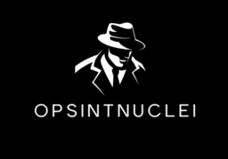
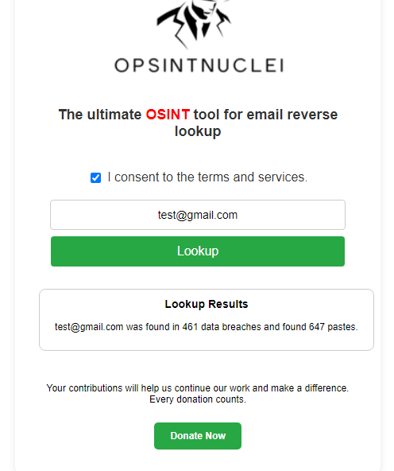
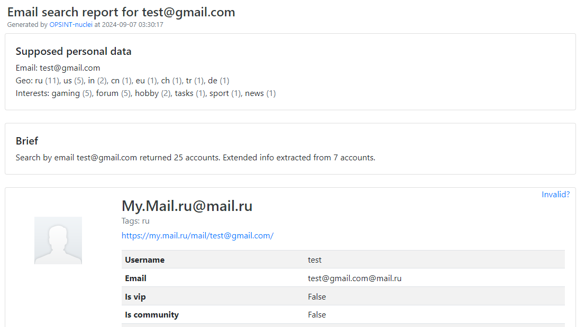

# OPSINT-Nuclei

    

**OPSINT-Nuclei** is a powerful Chrome extension designed for cybersecurity professionals, researchers, and anyone concerned about their online privacy. This extension leverages the capabilities of Nuclei’s API to perform reverse email lookups directly within your web browser.

> ❔ If you have questions or issues, **please refer to the [docs](.docs)**.

## Disclaimer

By using this project or its source code, for any purpose and in any shape or form, you grant your **implicit agreement** to all the following statements:

- You **agree that you hold responsibility and accountability of any consequences caused by your actions.**
- You **must not use this extension in any activity that is illegal or harmful to the service or other people.**
- You **are aware that the extension is provided “as is” without warranties of any kind.**

## Installation
> **Note**:
> The installation assumes you're using Chrome, but these steps can be replicated on any browser.
> You must extract the .ZIP file if you haven't cloned the repositry.

> **Note**:
> If you have issues with installation, you can follow this simple [YouTube tutorial](https://www.youtube.com/watch?v=oswjtLwCUqg).

1. Go to [extensions](chrome://extensions/).
2. On the Extensions page, toggle the **Developer mode** switch in the top-right corner.
3. Click **Load Unpacked**.
4. Go the folder containing all the extension files and click **Open**.

## Features

- User-Friendly interface that's easy to use.
- Cross-Platform compatibility
- Advanced Search functionality
- Integration with third-party services
- Secure data handling

  ## Screenshots

